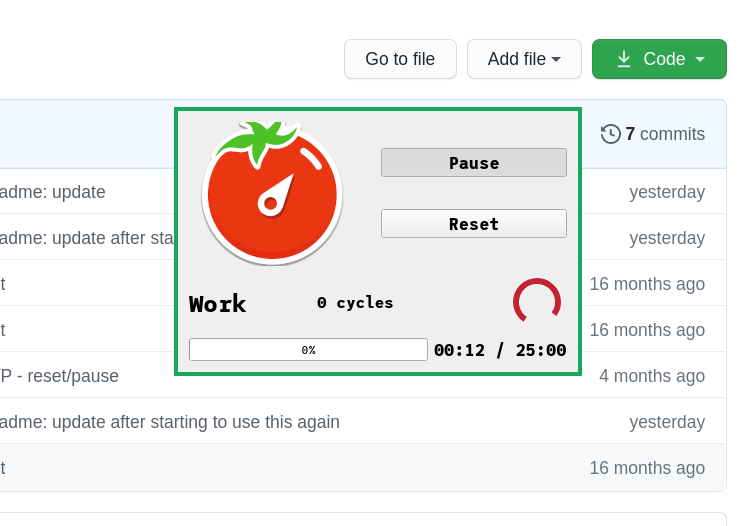

# Pomodoro timer

Yet another clone of pomodoro timer, cycling between work and procrastinate. Work for 25 minutes and rest for 5.

# Dependencies
both should be installed trivially: `python -m pip install <dependency_here>`
+ PyQt5
+ pydub
